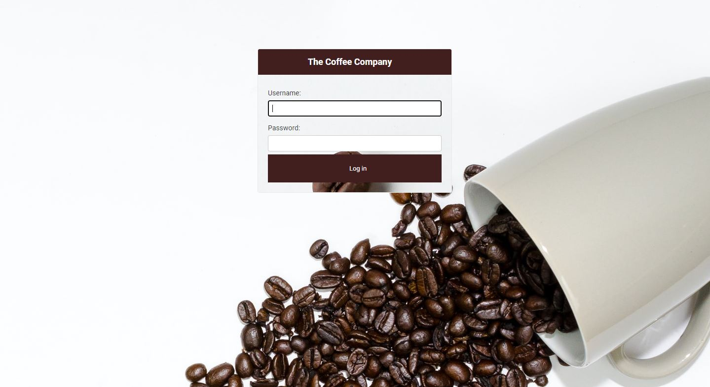
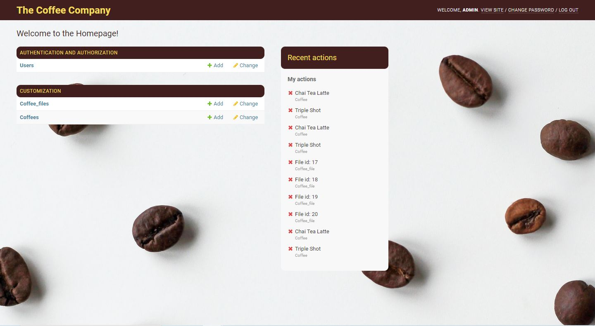

# Django_admin_customization

In this project, I customized parts of the admin section to create a coffee-like theme.

To run the application:
1. In your editor, run Pipenv install Django
2. Enter development environment with Pipenv Shell
3. Then install all dependencies with Pipenv install
4. Then run Python manage.py runserver and go to 127.0.0.1/admin

**USERNAME:** admin  
**PASSWORD:** testpass123

**Note:** I added an excel file named **'Coffee_db.csv'** which you can use to upload from 127.0.0.1:8000.
The data from the file will be added to the coffee model and the file will be attached in coffee_file model.

The changes I made in the admin panel are:
1. Changing background to admin-authentication page
2. Adding background and changing colours to Admin page
3. Importing and Eporting Excel file
4. Modifying Admin Filter/ Display View of Models
5. Changing Admin Title/Text
6. Adding a search button
7. Remove default apps from django

Below are some screenshots:

1. Admin Authentication

2. Admin Homepage

